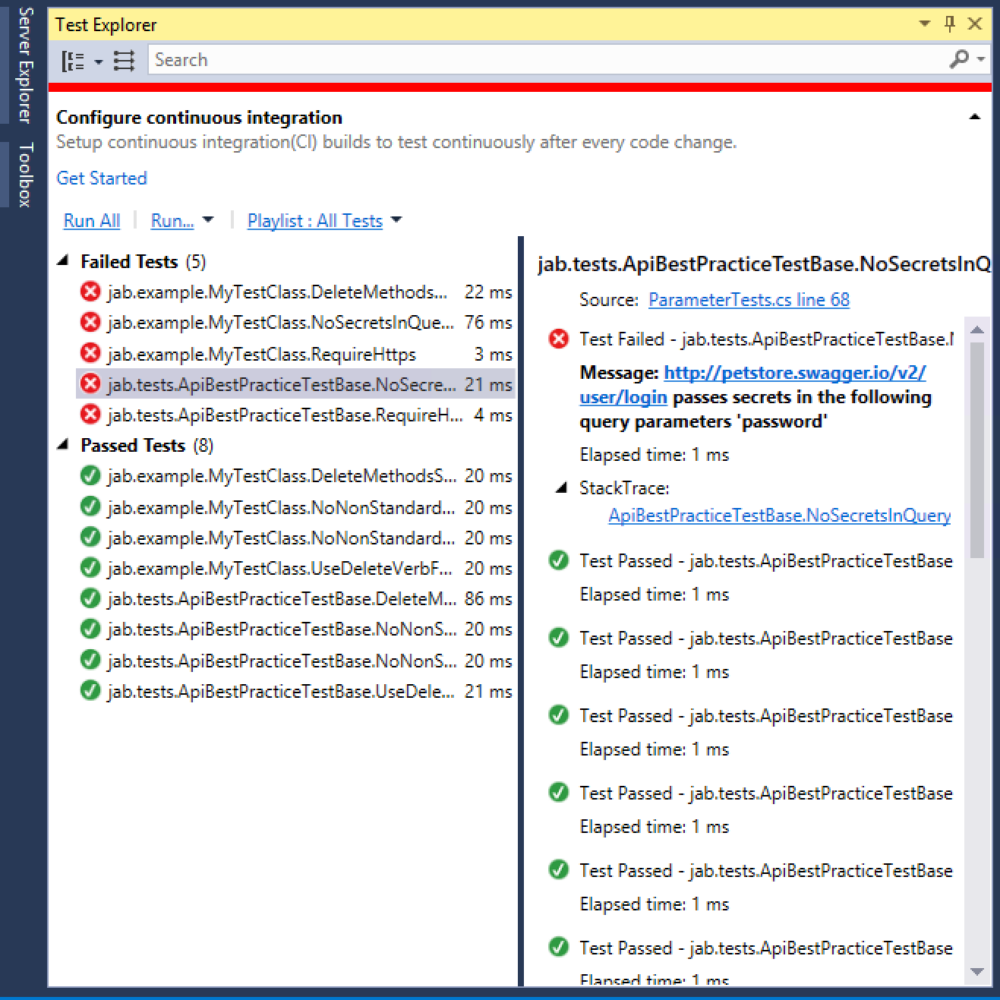

# jab
REST API testing tool for security best practices.

[](https://ci.appveyor.com/project/tonybaloney/jab)

Jab works by inspecting a Swagger 2 definition and "testing" it using a series
of assertions coded in xUnit.net.

Jab is designed to be used in a CI\CD process to inspect your REST API specification and
give you information on the OWASP REST best-practice guide, for example:

* Putting passwords in URLs as parameters
* Putting API keys in query parameters instead of in POST payloads


# Usage

## Command line

The `jab.console` project contains a command line utility for testing Swagger JSON files (and optionally an active endpoint).

```bash
jab.console.exe my_swagger.json
```

Or, you can also provide the URL 

```bash
jab.console.exe my_swagger.json http://petstore.swagger.io/v2/
```

Will give you an output similar to :

```
PS > .\jab.console.exe .\example.json http://petstore.swagger.io/v2/
Discovering...
Running 7 of 7 tests...
[FAIL] jab.tests.ApiBestPracticeTestBase.NoSecretsInQueryParameters(operation: JabApiOperation { Method = Get, Operation
 = SwaggerOperation { ActualConsumes = null, ActualParameters = [...], ActualProduces = [...], ActualSchemes = [...], Ac
tualSecurity = null, ... }, Path = "/user/login", Service = SwaggerService { BasePath = "/v2", BaseUrl = "http://petstor
e.swagger.io/v2", Consumes = null, Definitions = [...], DocumentPath = "fixtures/swagger.json", ... } }): http://petstor
e.swagger.io/v2/user/login passes secrets in the following query parameters 'password'
   at jab.tests.ApiBestPracticeTestBase.NoSecretsInQueryParameters(IJabApiOperation operation) in C:\Users\Administrator
\Documents\jab\jab\jab\Test\ParameterTests.cs:line 84
[FAIL] jab.tests.ApiBestPracticeTestBase.RequireHttps(service: SwaggerService { BasePath = "/v2", BaseUrl = "http://pets
tore.swagger.io/v2", Consumes = null, Definitions = [[Order, NJsonSchema.JsonSchema4], [Category, NJsonSchema.JsonSchema
4], [User, NJsonSchema.JsonSchema4], [Tag, NJsonSchema.JsonSchema4], [Pet, NJsonSchema.JsonSchema4], ...], DocumentPath
= "fixtures/swagger.json", ... }): http://petstore.swagger.io/v2 does not support HTTPS
Expected: True
Actual:   False
   at Xunit.Assert.True(Nullable`1 condition, String userMessage) in C:\BuildAgent\work\cb37e9acf085d108\src\xunit.asser
t\Asserts\BooleanAsserts.cs:line 90
   at Xunit.Assert.True(Boolean condition, String userMessage) in C:\BuildAgent\work\cb37e9acf085d108\src\xunit.assert\A
sserts\BooleanAsserts.cs:line 78
   at jab.tests.ApiBestPracticeTestBase.RequireHttps(SwaggerService service) in C:\Users\Administrator\Documents\jab\jab
\jab\Test\ServiceTests.cs:line 20
Finished: 121 tests in 0.580s (2 failed, 0 skipped)
```

## Visual Studio



You can use the `jab` library as a unit test base class by installing Jab from nuget.org (TBD).

Jab will assume that the swagger file is located in ``fixtures/swagger.json``, you can add an MSBuild task to
copy the Swagger output on build.

### Extending the built in rules

Use ``jab.tests.ApiBestPracticeTestBase`` as a base class, then you can write your special rules.

The attributes `Theory`, and `ApiOperationsData` should be used on Test Methods. `ApiOperationsData` is a data-driven attribute so that
the test method will be called for every single API operation in your Swagger definition.

```csharp
using System.Linq;
using jab.Fixture;
using jab.Interfaces;
using Xunit;


namespace jab.example
{
    public class MyTestClass
        : tests.ApiBestPracticeTestBase
    {
        public MyTestClass(ApiTestFixture fixture) : base(fixture)
        {
        }

        /// <summary>
        /// DELETE operations should always contain a ID parameter.
        /// </summary>
        /// <param name="apiOperation"></param>
        [Theory, ApiOperationsData("fixtures/swagger.json")]
        public void DeleteMethodsMustContainIdAsKeyParameter(IJabApiOperation apiOperation)
        {
            if (apiOperation.Method == NSwag.SwaggerOperationMethod.Delete)
            {
                Assert.True(apiOperation.Operation.Parameters.Count(p => p.Name == "id") > 0);
            }
        }
    }
}
```

### Integration tests

If your tests require connections to the API, the `jab` library injects a `Container` field to the test class which contains an instance of `System.Net.Http.HttpClient`.

You use the environment variables in `jab.Constants.active_tests_flag` to 1 to enable integration tests
and then 

```csharp
Environment.SetEnvironmentVariable(Constants.active_tests_flag, "1", EnvironmentVariableTarget.Process);
Environment.SetEnvironmentVariable(Constants.base_url_env, "https://my.url/api", EnvironmentVariableTarget.Process);
```

Then within your test class, use the `ActiveTheory` attribute and resolve the HttpClient using `this.Container.Resolve<HttpClient>();`

```csharp
[ActiveTheory]
[ApiOperationsData(testDefinition)]
public async Task RangedIntegerParameterTesting(IJabApiOperation operation)
{
    if (operation.Operation.ActualParameters.Any(
            parameter => parameter.Kind == SwaggerParameterKind.Query && parameter.Type == NJsonSchema.JsonObjectType.Integer)
            &&
        operation.Method == SwaggerOperationMethod.Get)
    {
        var client = this.Container.Resolve<HttpClient>();
        var parameter = operation.Operation.Parameters.First(p => p.Type == NJsonSchema.JsonObjectType.Integer && p.Kind == SwaggerParameterKind.Query);
                          
        var results = await client.GetAsync(operation.Path + "?" + parameter.Name + "=" + ulong.MaxValue.ToString());
        Assert.False(results.StatusCode != System.Net.HttpStatusCode.InternalServerError);
    }
}
```

# License

This project is licensed under the Apache Software Foundation License 2.0

# Contributing

Contributions are welcome, whether new rules, ideas or improvements to the mechanism.
